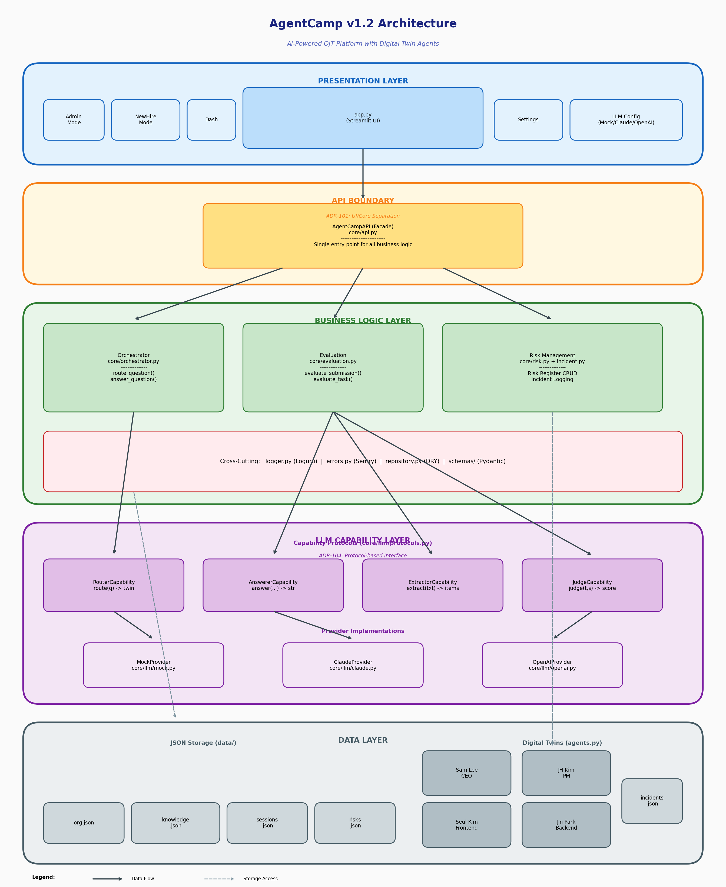
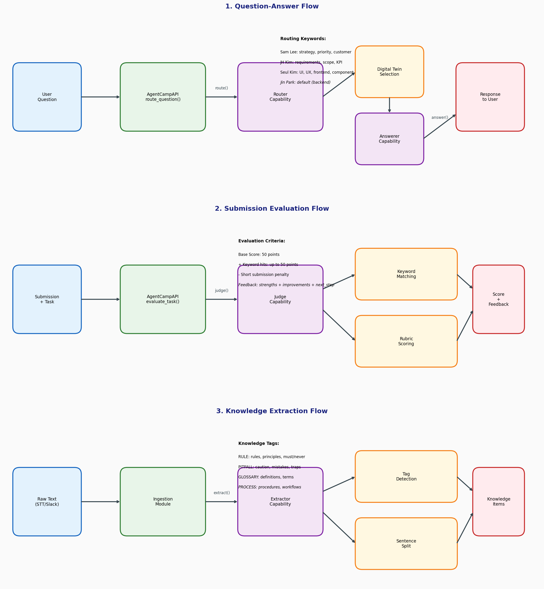

# AgentCamp - OJT Closed-Loop System

> **Version 1.2** | AI-Powered OJT Platform with Digital Twin Agents

[](https://agentcamp-demo-kvnmnjquyv6jfmwqhjt4f4.streamlit.app/)

---

## Overview

**AgentCamp**는 회사의 일상 텍스트(회의/Slack)에서 온보딩 지식을 추출해, 신입의 질문 답변과 제출 리뷰 기준을 즉시 업데이트하고, 그 결과를 적응/리스크 지표로 운영하는 **OJT closed-loop 시스템**이다.

| Item | Description |
|------|-------------|
| **Project Name** | AgentCamp |
| **Version** | 1.2 |
| **Type** | AI-Powered OJT (On-the-Job Training) Platform |
| **Core Concept** | 4 Digital Twin Agents + Knowledge Extraction + Adaptive Scoring |
| **Team** | Veluga |
| **License** | MIT |

---

## System Architecture (v1.2)



```
┌─────────────────────────────────────────────────────────────────────────────┐
│                           AgentCamp v1.2                                    │
├─────────────────────────────────────────────────────────────────────────────┤
│  ┌───────────────────────────────────────────────────────────────────────┐  │
│  │                    PRESENTATION LAYER                                  │  │
│  │                      app.py (Streamlit UI)                             │  │
│  │            [Admin Mode] [New Hire Mode] [Dashboard Mode]               │  │
│  └───────────────────────────────────────────────────────────────────────┘  │
│                                    │                                        │
│  ┌───────────────────────────────────────────────────────────────────────┐  │
│  │                    API BOUNDARY (ADR-101)                              │  │
│  │                    AgentCampAPI (core/api.py)                          │  │
│  │              Single entry point for all business logic                 │  │
│  └───────────────────────────────────────────────────────────────────────┘  │
│                                    │                                        │
│  ┌───────────────────────────────────────────────────────────────────────┐  │
│  │                    BUSINESS LOGIC LAYER                                │  │
│  │  ┌─────────────────┐ ┌─────────────────┐ ┌─────────────────────────┐  │  │
│  │  │   Orchestrator  │ │   Evaluation    │ │    Risk Management      │  │  │
│  │  │ route_question()│ │ evaluate_task() │ │  risk.py + incident.py  │  │  │
│  │  │answer_question()│ │evaluate_submit()│ │                         │  │  │
│  │  └─────────────────┘ └─────────────────┘ └─────────────────────────┘  │  │
│  └───────────────────────────────────────────────────────────────────────┘  │
│                                    │                                        │
│  ┌───────────────────────────────────────────────────────────────────────┐  │
│  │                    LLM CAPABILITY LAYER (ADR-104)                      │  │
│  │  ┌────────────┐ ┌────────────┐ ┌────────────┐ ┌────────────┐         │  │
│  │  │  Router    │ │  Answerer  │ │ Extractor  │ │   Judge    │         │  │
│  │  │ Capability │ │ Capability │ │ Capability │ │ Capability │         │  │
│  │  └────────────┘ └────────────┘ └────────────┘ └────────────┘         │  │
│  │         │              │              │              │                │  │
│  │  ┌────────────────────────────────────────────────────────────┐      │  │
│  │  │     Providers: [MockProvider] [ClaudeProvider] [OpenAI]    │      │  │
│  │  └────────────────────────────────────────────────────────────┘      │  │
│  └───────────────────────────────────────────────────────────────────────┘  │
│                                    │                                        │
│  ┌───────────────────────────────────────────────────────────────────────┐  │
│  │                    CROSS-CUTTING CONCERNS                              │  │
│  │    [logger.py (Loguru)] [errors.py (Sentry)] [repository.py (DRY)]    │  │
│  │                      [schemas/ (Pydantic)]                             │  │
│  └───────────────────────────────────────────────────────────────────────┘  │
│                                    │                                        │
│  ┌───────────────────────────────────────────────────────────────────────┐  │
│  │                    DATA LAYER                                          │  │
│  │   [org.json] [knowledge.json] [sessions.json] [risks.json] [twins]    │  │
│  └───────────────────────────────────────────────────────────────────────┘  │
└─────────────────────────────────────────────────────────────────────────────┘
```

---

## OJT Closed-Loop Flow



```
┌──────────────────────────────────────────────────────────────────────────┐
│                        OJT CLOSED-LOOP SYSTEM                            │
├──────────────────────────────────────────────────────────────────────────┤
│                                                                          │
│   ┌─────────────┐      ┌─────────────────┐      ┌─────────────┐         │
│   │  회의 STT   │─────▶│   Knowledge     │─────▶│  지식 베이스 │         │
│   │  Slack 대화 │      │   Extraction    │      │ (자동 업데이트)│         │
│   │  고객 미팅  │      │  (Extractor)    │      │             │         │
│   └─────────────┘      └─────────────────┘      └──────┬──────┘         │
│                                                        │                │
│   ┌─────────────┐      ┌─────────────────┐             │                │
│   │  신입 질문  │─────▶│    Router       │◀────────────┘                │
│   │             │      │  (라우팅)       │                              │
│   └─────────────┘      └────────┬────────┘                              │
│                                 │                                        │
│                        ┌────────▼────────┐      ┌─────────────┐         │
│                        │  Digital Twin   │─────▶│  응답 생성   │         │
│                        │   (4 Agents)    │      │ (Answerer)  │         │
│                        └─────────────────┘      └──────┬──────┘         │
│                                                        │                │
│   ┌─────────────┐      ┌─────────────────┐             │                │
│   │  업무 제출  │─────▶│     Judge       │◀────────────┘                │
│   │             │      │  (평가/피드백)   │                              │
│   └─────────────┘      └────────┬────────┘                              │
│                                 │                                        │
│                        ┌────────▼────────┐                              │
│                        │  적응도/리스크   │──────▶ HR Dashboard          │
│                        │     지표        │                              │
│                        └─────────────────┘                              │
│                                                                          │
└──────────────────────────────────────────────────────────────────────────┘
```

---

## Digital Twin Agents

| Agent | Role | Routing Keywords | Communication Style |
|-------|------|------------------|---------------------|
| **Sam Lee** | CEO | 우선순위, 전략, 고객, 리스크, 비용 | 짧고 결론 중심. 비용/속도/리스크를 함께 판단 |
| **JH Kim** | PM | 요구사항, 스코프, 정의, KPI, 지표 | 요구사항을 명확히 쪼개고 성공조건으로 정리 |
| **Seul Kim** | Frontend | UI, UX, 화면, 프론트, component | 사용자 흐름, UX, 에러 케이스, 구현 난이도 고려 |
| **Jin Park** | Backend | Default (fallback) | 시스템 관점. 데이터/성능/안정성/배포 기준 판단 |

---

## Project Structure (v1.2)

```
agentcamp-demo/
├── app.py                      # Streamlit UI (Presentation Layer)
├── agents.py                   # Digital Twin definitions
├── ingestion.py                # Knowledge extraction pipeline
│
├── core/                       # Business Logic Layer
│   ├── __init__.py             # Module exports
│   ├── api.py                  # AgentCampAPI Facade (ADR-101)
│   ├── orchestrator.py         # Question routing + response
│   ├── evaluation.py           # Submission evaluation
│   ├── storage.py              # JSON persistence
│   ├── repository.py           # BaseJSONRepository (DRY)
│   ├── risk.py                 # Risk register management
│   ├── incident.py             # Incident logging
│   ├── logger.py               # Loguru logging (LOG-002)
│   ├── errors.py               # Sentry integration (ERR-001)
│   └── llm/                    # LLM Capability Layer (ADR-104)
│       ├── protocols.py        # Capability interfaces
│       ├── mock.py             # Mock provider
│       ├── claude.py           # Claude provider
│       ├── openai.py           # OpenAI provider
│       └── factory.py          # Provider factory
│
├── schemas/                    # Data Contracts (ADR-102)
│   ├── __init__.py
│   ├── org.py                  # OrgConfig, RubricConfig
│   ├── knowledge.py            # KnowledgeItem, KnowledgeBase
│   ├── session.py              # UserSession, SessionStore
│   ├── risk.py                 # RiskItem, RiskRegister
│   ├── evaluation.py           # EvaluationResult, ReviewFeedback
│   └── enums.py                # Enumerations
│
├── tests/                      # Test Suite
│   ├── unit/                   # Unit tests (126 tests)
│   └── eval_suite/             # Evaluation tests
│
├── data/                       # JSON Storage
│   ├── org.json
│   ├── knowledge.json
│   ├── sessions.json
│   ├── risk_register.json
│   └── incidents.json
│
├── docs/
│   └── architecture/           # Architecture diagrams
│       ├── architecture_v1.2.png
│       ├── data_flow_v1.2.png
│       └── architecture.mmd
│
├── requirements.txt
└── CLAUDE.md                   # AI assistant guidelines
```

---

## Architecture Decision Records (ADR)

| ADR | Title | Description |
|-----|-------|-------------|
| **ADR-101** | UI/Core Boundary Separation | AgentCampAPI as single entry point |
| **ADR-102** | Pydantic Data Contracts | Type-safe data validation with schemas/ |
| **ADR-104** | Protocol-based LLM Interface | Capability protocols for LLM providers |

---

## Module Responsibilities

| Module | Layer | Responsibility |
|--------|-------|----------------|
| `app.py` | Presentation | Streamlit UI (Admin/NewHire/Dashboard) |
| `core/api.py` | API Boundary | AgentCampAPI Facade |
| `core/orchestrator.py` | Business Logic | Question routing + response generation |
| `core/evaluation.py` | Business Logic | Submission evaluation + feedback |
| `core/storage.py` | Data | JSON persistence with file permissions |
| `core/llm/protocols.py` | LLM | Capability interfaces (Router, Answerer, Extractor, Judge) |
| `core/llm/mock.py` | LLM | Mock provider for demo/testing |
| `core/logger.py` | Cross-cutting | Structured logging with Loguru |
| `core/errors.py` | Cross-cutting | Error handling with Sentry |
| `schemas/` | Data Contract | Pydantic models for validation |

---

## Technology Stack

| Layer | Technology | Purpose |
|-------|------------|---------|
| **Frontend** | Streamlit >= 1.37.0 | Web UI |
| **Validation** | Pydantic >= 2.8.0 | Data contracts |
| **Logging** | Loguru >= 0.7.0 | Structured logging |
| **Error Tracking** | Sentry SDK | Production monitoring |
| **LLM - Claude** | anthropic >= 0.18.0 | Anthropic API |
| **LLM - OpenAI** | openai >= 1.0.0 | OpenAI API |
| **Testing** | pytest >= 8.0.0 | Unit tests |
| **Deployment** | Streamlit Cloud | Hosting |

---

## Quick Start

```bash
# 1. Clone repository
git clone https://github.com/genelyuu/agentcamp-demo.git
cd agentcamp-demo

# 2. Install dependencies
pip install -r requirements.txt

# 3. Run application
streamlit run app.py

# 4. Run tests (optional)
pytest tests/ -v
```

### LLM Configuration

| Provider | API Key Required | Models |
|----------|------------------|--------|
| **mock** | No | Demo/Testing mode |
| **claude** | Yes | claude-sonnet-4-20250514, claude-3-5-sonnet-20241022 |
| **openai** | Yes | gpt-4o, gpt-4o-mini |

---

## Deployment

### Streamlit Cloud (Recommended)

AgentCamp은 **Streamlit Cloud**에 배포되어 있습니다.

| 항목 | 값 |
|------|-----|
| **Live Demo** | [agentcamp-demo.streamlit.app](https://agentcamp-demo-kvnmnjquyv6jfmwqhjt4f4.streamlit.app/) |
| **Platform** | Streamlit Cloud |
| **Runtime** | Python 3.11 |
| **Config** | `.streamlit/config.toml` |

### 배포 방식

Streamlit Cloud를 사용하여 배포합니다.

```bash
# GitHub 연동 후 자동 배포
git push origin main
```

---

## Key Features

| Mode | Feature | Description |
|------|---------|-------------|
| **Admin** | Knowledge Ingestion | 회의 STT/Slack 대화에서 지식 자동 추출 |
| **Admin** | Rubric Setup | 평가 키워드 설정 (원인/재현/재발방지/로그) |
| **New Hire** | OJT Questions | 4명의 Digital Twin 멘토에게 질문 |
| **New Hire** | Task Submission | AI 기반 피드백과 점수 제공 |
| **Dashboard** | Analytics | 적응도/리스크 지표 모니터링 |
| **Dashboard** | Risk Management | 리스크 레지스터 및 인시던트 추적 |

---

## Design Principles

| Principle | Implementation |
|-----------|----------------|
| **Single Responsibility** | 모듈별 단일 책임 (orchestrator, evaluation, storage) |
| **Open/Closed** | Protocol 기반 LLM 확장 (ADR-104) |
| **Dependency Inversion** | UI → API Facade → Core 의존성 역전 |
| **DRY** | BaseJSONRepository로 CRUD 추상화 |
| **Type Safety** | Pydantic schemas로 데이터 검증 |

---

## Version History

| Version | Date | Changes |
|---------|------|---------|
| **1.2** | 2026-01-19 | Architecture refactoring, ADR-101/102/104, logging, error handling, 126 unit tests |
| **1.0** | 2026-01-19 | Initial release with 4 Digital Twins, Mock/Claude/OpenAI support |

---

## Team

**Veluga** - AI-Powered Onboarding Solutions

---

## License

MIT License

---

<p align="center">
    <b>OJT Closed-Loop System for Adaptive Onboarding</b><br>
    <i>AgentCamp v1.2 | Veluga</i>
</p>
