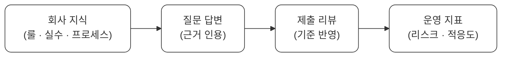
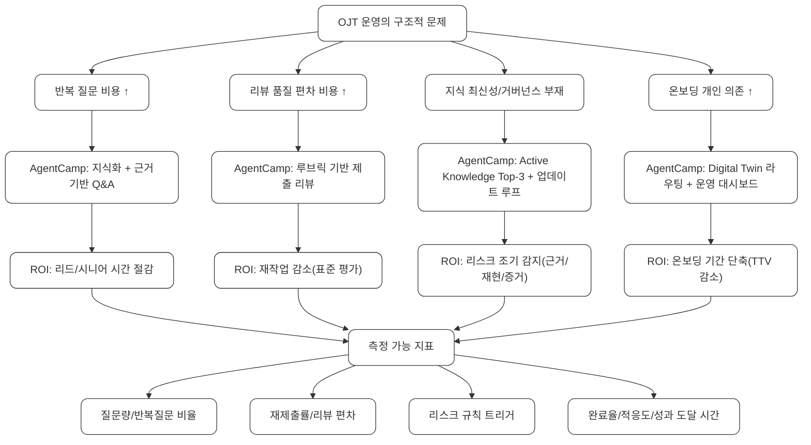

<p align="center">
  
  
  
  <a href="https://agentcamp-demo-kvnmnjquyv6jfmwqhjt4f4.streamlit.app/">
    
  </a>
</p>

<h1 align="center">AgentCamp</h1>

<p align="center">
  <strong>AI로 바꾸는 온보딩(OJT) 운영</strong><br/>
  <code>회사 지식 → 질문 → 리뷰 → 지표</code> 폐루프
</p>

<p align="center">
  <a href="https://agentcamp-demo-kvnmnjquyv6jfmwqhjt4f4.streamlit.app/"><strong>🚀 Live Demo</strong></a> •
  <a href="#-tldr">TL;DR</a> •
  <a href="#-핵심-흐름">핵심 흐름</a> •
  <a href="#-제품-개요">제품 개요</a> •
  <a href="#-사업성">사업성</a> •
  <a href="#-기술">기술</a> •
  <a href="#-quick-start">Quick Start</a>
</p>

---

## TL;DR

> **AgentCamp**는 조직의 '일상 텍스트'를 자동으로 **회사 룰·실수 패턴·프로세스**로 정리하고,  
> 그 지식이 **질문 답변 → 제출 리뷰 → HR 대시보드**까지 즉시 연결되는 **OJT 운영 AI**입니다.

<br/>

### "AI로 바꾸는 일과 업무"

실제 업무에서 AI가 바꿔야 하는 건 "한 번 멋진 답변"이 아니라 **업무 운영의 비용 구조**입니다.

<table>
  <colgroup>
    <col style="width: 28%;" />
    <col style="width: 72%;" />
  </colgroup>
  <thead>
    <tr>
      <th align="left"><strong>비용 유형</strong></th>
      <th align="left"><strong>문제</strong></th>
    </tr>
  </thead>
  <tbody>
    <tr>
      <td><strong>반복 질문 비용</strong></td>
      <td>신입은 같은 질문을 반복하고, 리드/시니어는 같은 답을 반복</td>
    </tr>
    <tr>
      <td><strong>리뷰 품질 편차 비용</strong></td>
      <td>제출물 평가 기준이 사람마다 달라 “재작업” 발생</td>
    </tr>
  </tbody>
</table>

<br/>

> **AgentCamp는 이 지점을 "문서화"가 아니라 운영 시스템으로 바꿉니다.**

<br/>

### 지식이 답변에서 끝나지 않고, 평가와 지표로 연결된다



<p align="center">
  <strong>AI는 "대화"가 아니라 "업무 운영"을 바꿉니다.</strong>
</p>

---

## 핵심 흐름



<br/>

### AgentCamp의 ROI (정량화가 쉬움)

<table>
  <colgroup>
    <col style="width: 26%;" />
    <col style="width: 74%;" />
  </colgroup>
  <thead>
    <tr>
      <th align="left"><strong>ROI 항목</strong></th>
      <th align="left"><strong>효과</strong></th>
    </tr>
  </thead>
  <tbody>
    <tr>
      <td><strong>반복 질문 감소</strong></td>
      <td>리드/시니어 시간 절감</td>
    </tr>
    <tr>
      <td><strong>리뷰 기준 표준화</strong></td>
      <td>재작업 감소</td>
    </tr>
    <tr>
      <td><strong>리스크 조기 감지</strong></td>
      <td>근거 부족/재현 부재 등 패턴 추적</td>
    </tr>
    <tr>
      <td><strong>온보딩 기간 단축</strong></td>
      <td>성과 도달 시간 단축</td>
    </tr>
  </tbody>
</table>

<br/>

### 비즈니스 모델 (해커톤 이후 확장)

<table>
  <colgroup>
    <col style="width: 18%;" />
    <col style="width: 82%;" />
  </colgroup>
  <thead>
    <tr>
      <th align="left"><strong>플랜</strong></th>
      <th align="left"><strong>내용</strong></th>
    </tr>
  </thead>
  <tbody>
    <tr>
      <td><strong>B2B SaaS</strong></td>
      <td>온보딩/교육 대상 인원 기준 과금 (per seat)</td>
    </tr>
    <tr>
      <td><strong>팀 플랜</strong></td>
      <td>Slack/회의 연동 + 지식 거버넌스 + 감사 로그</td>
    </tr>
    <tr>
      <td><strong>Enterprise</strong></td>
      <td>SSO, 권한관리, 개인정보/보안 정책, 모델 선택</td>
    </tr>
  </tbody>
</table>

---

## 기술

### Offline-first + LLM Enhanced

<table>
  <colgroup>
    <col style="width: 22%;" />
    <col style="width: 78%;" />
  </colgroup>
  <thead>
    <tr>
      <th align="left"><strong>모드</strong></th>
      <th align="left"><strong>설명</strong></th>
    </tr>
  </thead>
  <tbody>
    <tr>
      <td><strong>Offline (기본)</strong></td>
      <td>API Key 없이도 100% 동작 — 데모 안정성 최우선</td>
    </tr>
    <tr>
      <td><strong>LLM Enhanced</strong></td>
      <td>Key가 있으면 답변/추출/리뷰 품질 업그레이드</td>
    </tr>
    <tr>
      <td><strong>Fail-safe</strong></td>
      <td>LLM 실패/지연 시 즉시 오프라인 모드로 폴백</td>
    </tr>
  </tbody>
</table>

<br/>

### Tech Stack (Mermaid)

```mermaid
flowchart LR
  FE["Frontend<br/>Streamlit"] --> BE["Backend<br/>Python"]
  BE --> LLM["LLM (Optional)<br/>OpenAI / Anthropic"]
  BE --> DEP["Deployment<br/>Minimal dependencies"]

  classDef box fill:#fff,stroke:#333,stroke-width:1px,rx:10,ry:10;
  class FE,BE,LLM,DEP box;
---

---

## 제품 개요

> **3모드로 완결되는 OJT 운영**

<br/>

### 1️⃣ Admin (회사 세팅/데이터 업로드)

<table>
  <colgroup>
    <col style="width: 22%;" />
    <col style="width: 78%;" />
  </colgroup>
  <thead>
    <tr>
      <th align="left"><strong>기능</strong></th>
      <th align="left"><strong>설명</strong></th>
    </tr>
  </thead>
  <tbody>
    <tr>
      <td><strong>회사/직무 세팅</strong></td>
      <td>회사명, 직무, 루브릭(데모) 설정</td>
    </tr>
    <tr>
      <td><strong>지식 업로드</strong></td>
      <td>회의 STT/Slack 텍스트 → 규칙/실수/프로세스 자동 추출</td>
    </tr>
    <tr>
      <td><strong>Active Knowledge</strong></td>
      <td><strong>Top-3</strong> “운영에 쓰이는 지식” 고정 표시</td>
    </tr>
  </tbody>
</table>

<br/>

### 2️⃣ New Hire (OJT 실행)

<table>
  <colgroup>
    <col style="width: 22%;" />
    <col style="width: 78%;" />
  </colgroup>
  <thead>
    <tr>
      <th align="left"><strong>기능</strong></th>
      <th align="left"><strong>설명</strong></th>
    </tr>
  </thead>
  <tbody>
    <tr>
      <td><strong>오늘의 미션</strong></td>
      <td>업무 컨텍스트 포함된 미션 수령</td>
    </tr>
    <tr>
      <td><strong>질문하기</strong></td>
      <td>Digital Twin 라우팅 + 근거(키워드/스코어) 노출</td>
    </tr>
    <tr>
      <td><strong>제출하기</strong></td>
      <td>구조 루브릭 점수/피드백 + 회사 지식 인용</td>
    </tr>
  </tbody>
</table>

<br/>

### 3️⃣ Dashboard (HR/리드 운영)

<table>
  <colgroup>
    <col style="width: 22%;" />
    <col style="width: 78%;" />
  </colgroup>
  <thead>
    <tr>
      <th align="left"><strong>기능</strong></th>
      <th align="left"><strong>설명</strong></th>
    </tr>
  </thead>
  <tbody>
    <tr>
      <td><strong>통합 현황</strong></td>
      <td>질문량/트윈 호출/재제출/완료 업무/적응도/리스크</td>
    </tr>
    <tr>
      <td><strong>리스크 규칙</strong></td>
      <td>지표의 의미를 명시하여 고정</td>
    </tr>
  </tbody>
</table>

---

## 사업성

### 문제는 보편적이고 반복된다

<table>
  <colgroup>
    <col style="width: 26%;" />
    <col style="width: 74%;" />
  </colgroup>
  <thead>
    <tr>
      <th align="left"><strong>조직 유형</strong></th>
      <th align="left"><strong>문제</strong></th>
    </tr>
  </thead>
  <tbody>
    <tr>
      <td><strong>스타트업/중소팀</strong></td>
      <td>온보딩 문서가 없거나 최신성 유지가 어려움</td>
    </tr>
    <tr>
      <td><strong>성장기 조직</strong></td>
      <td>제품/프로세스 변화 속도가 빨라 사람이 따라가기 어려움</td>
    </tr>
    <tr>
      <td><strong>원격·분산팀</strong></td>
      <td>Slack/회의에 지식이 흩어져 온보딩이 개인 의존적으로 운영됨</td>
    </tr>
  </tbody>
</table>

<br/>


---

## Quick Start

```bash
# 1. 의존성 설치
pip install -r requirements.txt

# 2. 실행
streamlit run app.py
```

---

## 2-Min Demo Script

> **Click-by-click 데모 시나리오**

<table>
  <colgroup>
    <col style="width: 10%;" />
    <col style="width: 14%;" />
    <col style="width: 76%;" />
  </colgroup>
  <thead>
    <tr>
      <th align="center"><strong>Step</strong></th>
      <th align="left"><strong>Mode</strong></th>
      <th align="left"><strong>Action</strong></th>
    </tr>
  </thead>
  <tbody>
    <tr>
      <td align="center"><strong>1</strong></td>
      <td><strong>Admin</strong></td>
      <td>STT/Slack 텍스트 업로드 → "지식 추출 & 저장" → Active Knowledge Top-3 확인</td>
    </tr>
    <tr>
      <td align="center"><strong>2</strong></td>
      <td><strong>New Hire</strong></td>
      <td>질문 입력 → 라우팅 근거/후보 확인 → 트윈 답변(역할별 스키마) + 지식 인용 확인</td>
    </tr>
    <tr>
      <td align="center"><strong>3</strong></td>
      <td><strong>New Hire</strong></td>
      <td>제출 → 구조 루브릭(원인/재현/재발/증거) 체크 + 점수/피드백 확인</td>
    </tr>
    <tr>
      <td align="center"><strong>4</strong></td>
      <td><strong>Dashboard</strong></td>
      <td>질문량/업무완료/리스크/적응도 확인</td>
    </tr>
  </tbody>
</table>

---

<p align="center">
  <strong>Team Veluga</strong><br/>
  <sub>Built with Streamlit + Python</sub>
</p>
