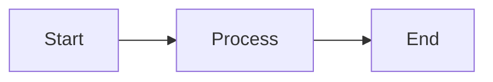

# AgentCamp Documentation

## Overview

AgentCamp은 린 스타트업을 위한 AI 기반 OJT(On-the-Job Training) 플랫폼입니다.
본 문서 디렉토리는 기술적 의사결정, 아키텍처, 버전 비교를 포함합니다.

---

## Document Structure

```
docs/
├── README.md                 # 이 파일
├── EXECUTIVE_REPORT.md       # C-Level 보고서 (v1.0 vs v1.2)
├── VERSION_COMPARISON.md     # 버전 비교 상세
├── PRD.md                    # 제품 요구사항
├── TRD.md                    # 기술 요구사항
├── ARCHITECTURE.md           # 아키텍처 결정 개요
├── IA.md                     # 정보 아키텍처
│
├── adr/                      # Architecture Decision Records
│   ├── v1.0/                 # v1.0 (Hackathon Demo)
│   │   ├── README.md
│   │   ├── ADR-001-monolithic-streamlit.md
│   │   ├── ADR-002-json-storage.md
│   │   ├── ADR-003-mock-first-llm.md
│   │   └── ADR-004-keyword-routing.md
│   │
│   ├── v1.2/                 # v1.2 (Enterprise-Ready)
│   │   ├── README.md
│   │   ├── ADR-101-ui-core-boundary.md
│   │   ├── ADR-102-data-contract.md
│   │   ├── ADR-103-evaluation-gate.md
│   │   ├── ADR-104-llm-interface.md
│   │   └── ADR-105-risk-register.md
│   │
│   └── v1.3/                 # v1.3 (Hackathon Review Prep)
│       ├── README.md
│       ├── ADR-106-citation-transparency.md
│       └── ADR-107-twin-differentiation.md
│
└── diagrams/                 # 아키텍처 다이어그램
    ├── v1.0-architecture.md  # v1.0 논리 아키텍처
    ├── v1.0-sequence.md      # v1.0 시퀀스 다이어그램
    ├── v1.2-architecture.md  # v1.2 논리 아키텍처
    ├── v1.2-dataflow.md      # v1.2 데이터 흐름
    └── v1.2-release.md       # v1.2 릴리즈 프로세스
```

---

## Quick Links

### For Executives

- **[Executive Report](./EXECUTIVE_REPORT.md)** - C-Level 보고 형식의 기술 현황 및 권장 사항

### For Architects

- **[Version Comparison](./VERSION_COMPARISON.md)** - v1.0 vs v1.2 상세 비교
- **[v1.0 ADRs](./adr/v1.0/README.md)** - 해커톤 데모 아키텍처 결정
- **[v1.2 ADRs](./adr/v1.2/README.md)** - 엔터프라이즈 준비 아키텍처 결정
- **[v1.3 ADRs](./adr/v1.3/README.md)** - 심사 대비 개선 (Citation, Twin Differentiation)

### For Developers

- **[v1.0 Architecture Diagram](./diagrams/v1.0-architecture.md)**
- **[v1.0 Sequence Diagrams](./diagrams/v1.0-sequence.md)**
- **[v1.2 Architecture Diagram](./diagrams/v1.2-architecture.md)**
- **[v1.2 Data Flow](./diagrams/v1.2-dataflow.md)**

---

## Version Overview

### v1.0 (Current - Hackathon Demo)

| Aspect | Description |
|--------|-------------|
| **목적** | 해커톤 데모 (2시간 시연) |
| **구조** | Monolithic Streamlit |
| **저장소** | Local JSON files |
| **LLM** | Mock-first, optional API |
| **테스트** | None |

### v1.2 (Proposed - Enterprise Ready)

| Aspect | Description |
|--------|-------------|
| **목적** | 엔터프라이즈 파일럿 |
| **구조** | Boundary-enforced layers |
| **저장소** | SQLite + Pydantic validation |
| **LLM** | Capability-based switching |
| **테스트** | Eval Suite + Regression |

---

## ADR Naming Convention

| Range | Version | Description |
|-------|---------|-------------|
| ADR-001 ~ ADR-099 | v1.0 | Hackathon demo decisions |
| ADR-100 ~ ADR-105 | v1.2 | Enterprise enhancement decisions |
| ADR-106 ~ ADR-199 | v1.3 | Hackathon review preparation |
| ADR-200+ | v2.0+ | Future major versions |

---

## Diagram Format

모든 다이어그램은 Mermaid 형식으로 작성되어 GitHub에서 직접 렌더링됩니다.



ASCII 다이어그램도 함께 제공되어 텍스트 환경에서도 확인 가능합니다.

---

## Contributing

1. ADR 추가 시 해당 버전 디렉토리에 생성
2. 다이어그램 추가 시 `diagrams/` 디렉토리에 생성
3. README 파일의 링크 업데이트

---

*Last updated: 2026-01-19*
